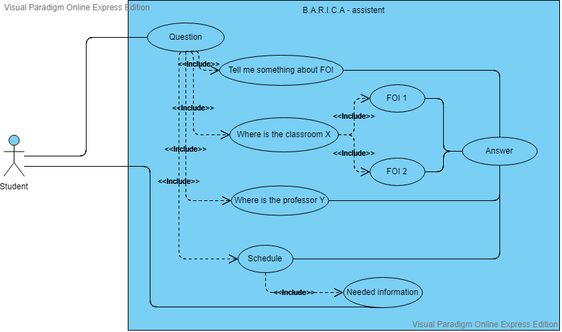

# B.A.R.I.C.A - assistant

B.A.R.I.C.A. assistant is a recursive acronym standing for "Barica is an ARtificial Intelligence Cognitive Agent". Playing with acronyms is fun, but really Barica is a traditional name from Hrvatsko Zagorje, a northern part of Croatia where our Faculty resides. B.A.R.I.C.A. assistant is designed for helping students on the Faculty of Organization and Informatics by giving them useful information about classroom location, professors and schedule. 



## Getting Started

To get start copy project and run the program on your local machine by next instructions.

### Prerequisites

You can start the program in Python3 on a Windows or Linux system. Open the command line (Windows) or terminal (Linux), go to the program directory and execute next commands.

Windows
```
pip install -r requirements.txt

python talk.py --train

```

Linux
```
pip3 install -r requirements.txt

python3 talk.py --train

```

## Running

Go to https://voicenotebook.com/ in Chrome browser. Install Chrome extensions. Choose speech language Croatian and check Transfer to clipboard. Click Start recording.

For running the program open the command line (Windows) or terminal (Linux), go to the program directory and execute next commands.

Windows
```
python talk.py

```

Linux
```
python3 talk.py

```

## Licences

Image of Barica is from https://pixabay.com/en/woman-robot-artificial-intelligence-3124083/ for fair use.
