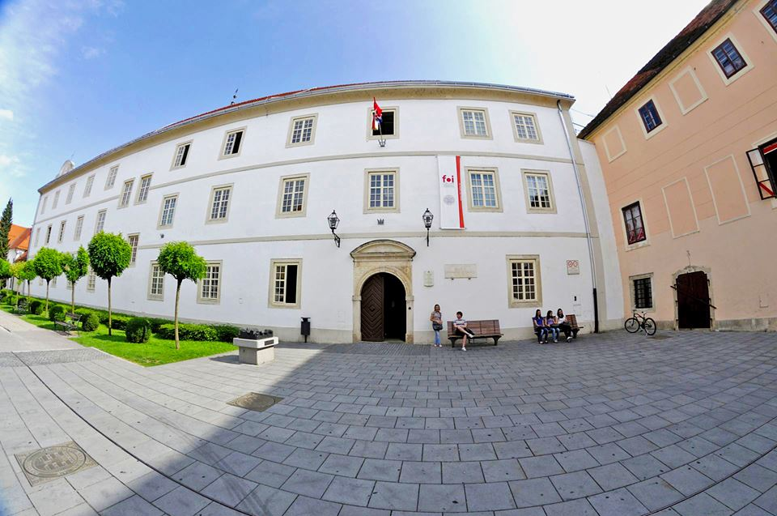

:title: B.A.R.I.C.A asistentica
:data-transition-duration: 1500
:skip-help: true
:css: prezentacija.css
:js-header: jquery-3.3.1.min.js
:js-header: messages.js
:css: barica.css
:css: video_barica.mp4

----

B.A.R.I.C.A.
============

Obrati mi se sa *Barice?*

Pitaj me o fakultetu,

rasporedu, dvoranama ili

profesorima!

:: 

   AILab @ FOI
   
   
----

Fakultet organizacije i informatike:
====================================

*Varaždin*
----------

   

----

Podaci o profesoru:
===================

----

Vrsta studija?
==============

	* Informacijski/Poslovni sustavi 1.1 - Preddiplomski
	* Ekonomika poduzetništva 1.0 - Preddiplomski
	* Ekonomika poduzetništva 1.1 - Preddiplomski
	* Diplomski studij informatike 1.2 - Diplomski
	* Diplomski studij Ekonomika poduzetništva 1.0 - Diplomski
	* PITUP Varaždin 1.1 - Stručni
	* PITUP Varaždin 1.2 - Stručni
	* PITUP Križevci 1.1 - Stručni
	* PITUP Križevci 1.2 - Stručni
	* PITUP Sisak 1.1 - Stručni
	* PITUP Sisak 1.2 - Stručni
	* PITUP Zabok 1.1 - Stručni
	* PITUP Zabok 1.2 - Stručni
	* Upravljanje sigurnošću i revizijom informacijskih sustava 1.0 - Specijalistički
	* Upravljanje sigurnošću i revizijom informacijskih sustava 2.0 - Specijalistički
	* Inženjerstvo i reinženjerstvo organizacija informacijskog doba 1.0 - Specijalistički
	* Menadžment poslovnih sustava 1.0 - Specijalistički
	* Poslijediplomski doktorski studij 1.1 - Doktorski
	* Pedagoško - psihološko - didaktičko - metodičko obrazovanje 1.0 - Specijalistički
   
   
----

Godina studija?
===============

	* Prva
	* Druga
	* Treća
	
	
----

Grupa?
======

----

Raspored nedostupan
====================

*Za navedenu vrstu studija i godinu studiranja nije dostupan raspored!*
-----------------------------------------------------------------------

 
	
   

   
   

   
